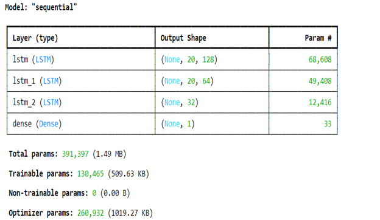
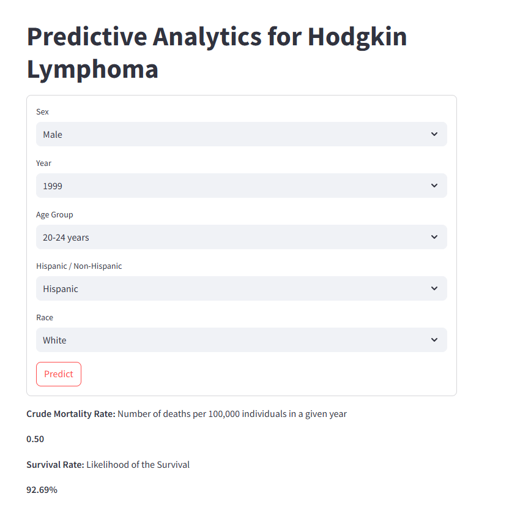

# Predictive Analytics for Hodgkin Lymphoma (HL)

## Table of Contents

1. [Introduction](#introduction)
2. [Dataset Collection](#dataset-collection)
3. [Data Preprocessing](#data-preprocessing)
4. [Features and Target Variables](#features-and-target-variables)
5. [Algorithm Selection](#algorithm-selection)
6. [Model Architecture](#model-architecture)
7. [Results](#results)
8. [Diagnostic Tool](#diagnostic-tool)
9. [License](#license)

---

## Introduction

**Hodgkin lymphoma** is characterized by a bimodal age distribution, with higher mortality rates observed among older patients. However, the influence of other demographic factors on mortality and survival remains less explored. Understanding these factors is crucial for improving patient outcomes and treatment strategies.

This study leverages advanced predictive analytics by utilizing a **Long Short-Term Memory (LSTM)** neural network to analyze and project trends in Hodgkin lymphoma. The model is designed to predict two critical health metrics: **Crude Mortality Rate** (the number of deaths per 100,000 individuals annually) and **Survival Rate** (the percentage likelihood of survival). By incorporating a comprehensive dataset of demographic and temporal variables, including age, sex, ethnicity, race, and year, the model provides valuable insights into health outcomes. Additionally, this study examines current trends in Hodgkin lymphoma and offers a predictive framework to project future trends, supporting healthcare providers in developing more effective and personalized care strategies.

Additionally, an interactive **diagnostic tool** has been deployed, allowing users to input specific demographic and temporal details to generate predictions. This tool serves as a practical application of the model, aiding researchers and healthcare professionals in assessing trends and disparities in **Hodgkin Lymphoma** outcomes. The project emphasizes precision and temporal modeling to support informed decision-making in public health and oncology.

---

## Dataset Collection

- **Dataset**: [CDC WONDER Mortality Data (1999-2020)](https://wonder.cdc.gov/)
- Data for developing the predictive model for survival assessment in patients was sourced from the CDC WONDER (Centers for Disease Control and Prevention Wide-ranging Online Data for Epidemiologic Research) website. The CDC WONDER online database provides a variety of public health data sets, including detailed mortality data. To gather the necessary data, the following steps were taken:
Accessing the CDC WONDER Database: The data collection began by navigating to the CDC WONDER website. The specific data set used was the "1999-2020 Mortality Data".

---
## Data Preprocessing
### Handling Missing Values
**Approach**: Any rows with missing values were removed from the dataset. This ensures that the model is trained on complete cases, avoiding the introduction of biases or inaccuracies due to imputation.

### Normalizing Data
**Features**: All features including sex, year, age, ethnicity, race, and target variable (crude rate) were normalized using MinMaxScaler. This scales the features to a range between 0 and 1, facilitating better convergence during model training.

**Rationale**: Normalization is crucial for algorithms like LSTM, which are sensitive to the scale of input data. It helps in stabilizing the training process and improving model performance.

#### Definition of MinMaxScaler
**MinMaxScaler**: MinMaxScaler is a normalization technique provided by the scikit-learn library. It transforms features by scaling each feature to a given range, often between 0 and 1. The scaling is done independently on each feature.

### Encoding Categorical Variables
**Sex, Ethnicity, Race**: These categorical variables were encoded into numerical values using predefined mappings:
- **Sex**: Male = 0, Female = 1
- **Ethnicity**: Hispanic = 1, Non-Hispanic = 0
- **Race**:
  - Black or African American = 0
  - White = 1
  - Asian or Pacific Islander = 2
  - American Indian or Alaska Native = 3

**Age Groups**: Categorical age groups were mapped to numerical values ranging from 0 to 17, corresponding to the specific age categories.

**Rationale**: Encoding categorical variables as numerical values allows the model to process them effectively, preserving their intrinsic differences and relationships. This is essential for the model to learn from these predictors and make accurate predictions.

---
## Features and Target Variables

### Features
1. **Demographic Variables**:
   - Age Group (Categorized into ranges)
   - Sex
   - Ethnicity
   - Race
2. **Temporal Variables**:
   - Year (Predictive Year)

### Target Variables
1. **Crude Rate**: Number of deaths per 100,000 individuals in a given year.
2. **Survival Rate**: Likelihood of survival expressed as a percentage.

---

## Algorithm Selection

### Rationale for Selecting LSTM
The choice of using a Long Short-Term Memory (LSTM) neural network for predicting crude rates in Hodgkin Lymphoma (HL) was driven by the inherent capability of LSTM models to capture temporal dependencies and long-term relationships in sequential data. Traditional machine learning models, such as linear regression or decision trees, often struggle with time series data due to their limited ability to account for temporal order and dependencies.

LSTM networks, a specialized form of Recurrent Neural Networks (RNNs), are explicitly designed to handle sequences of data. They incorporate memory cells that can maintain information over extended time intervals, effectively addressing the vanishing gradient problem commonly encountered in standard RNNs. This allows LSTMs to retain and utilize historical information, which is crucial in medical datasets where past events and trends significantly influence future outcomes.

#### In the Context of Predicting Crude Rates for HL, the LSTM Network's Ability to:
1. **Retain Long-Term Dependencies**: 
   By maintaining cell states over time, LSTM networks can capture and leverage long-term dependencies in the data, such as historical trends in mortality rates, advancements in medical treatments, and changes in diagnostic practices.

2. **Handle Variable Length Sequences**: 
   LSTMs can process input sequences of variable lengths, making them suitable for datasets where the length of historical data available may vary across different instances.

3. **Learn Complex Temporal Patterns**: 
   The architecture of LSTMs allows them to learn and model complex temporal patterns and interactions between features over time, leading to more accurate and robust predictions.

#### Creating Sequences
- The data was transformed into sequences to capture the temporal relationships. Each sequence included a set of past observations (e.g., 20 time steps) to predict the next value. This approach ensures that the model can leverage historical information to make accurate predictions about future crude rates.

- These technical advantages of LSTM networks make them particularly well-suited for our objective of predicting crude rates in HL, where capturing and modeling temporal dynamics is essential for accurate forecasting. Consequently, the LSTM model was chosen as the primary algorithm for this study, ensuring that the temporal aspect of the data is adequately addressed, leading to more reliable and insightful predictions.

## Model Architecture

The LSTM model comprises:
- **3 LSTM Layers**:
  - First Layer: 128 units
  - Second Layer: 64 units
  - Third Layer: 32 units
- **1 Dense Layer**:
  - Output: Crude Rate or Survival Rate
- **Total Parameters**: 391,397 (Trainable: 130,465)

Below is the summary of the LSTM model:

---

## Results

The model achieved:
- **Training MSE**: 0.0113
- **Validation MSE**: 0.0219

These metrics indicate the model's accuracy in predicting both target variables.

---

## Diagnostic Tool

The project includes a Streamlit-based diagnostic tool that allows users to input demographic and temporal data to predict Crude Rate and Survival Rate.

- Access the tool here: [Hodgkin Lymphoma Diagnostic Tool](https://hodgkin-lymphoma-lstm.streamlit.app/)
- ### Example Output

---
## License

The data used in this project is sourced from the **CDC WONDER Online Database** ("1999-2020 Mortality Data"). The use of this data is subject to the following restrictions, as outlined by the CDC WONDER:

1. **Purpose of Use**: The data is provided exclusively for statistical reporting and analysis. It may not be used for commercial purposes.
2. **Prohibition of Identification**: Users must not attempt to identify individuals or establishments in the dataset. If an individual's identity is inadvertently discovered, it must not be disclosed or used, and the discovery should be reported to the NCHS Confidentiality Officer.
3. **Presentation Restrictions**: Published data must not include statistics based on counts of nine or fewer deaths, births, or events to prevent potential identification of individuals.
4. **No Redistribution**: Redistribution of the raw data or datasets is prohibited.

For more details, visit the [CDC WONDER Data Use Restrictions](https://wonder.cdc.gov/DataUse.html).

By accessing and using the data in this repository, users agree to comply with these restrictions and respect the privacy of the data subjects.

